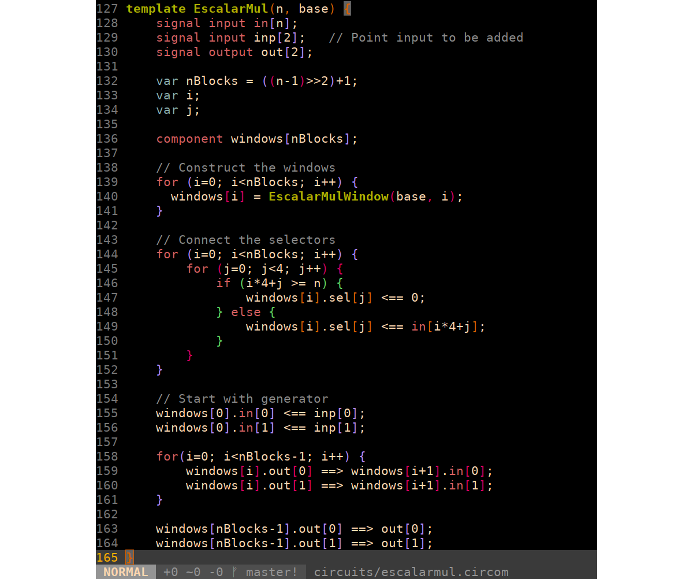

# Circom syntax highlighting for vim

This is a [circom](https://github.com/iden3/circom) syntax highlighting file
for vim, based on the vim 8.1 javascript syntax highlighting file.

## Screenshot



## Installation in vim/nvim

- Using [Plug](https://github.com/junegunn/vim-plug) (recommended), add this line to your `.vimrc`:
```
Plug 'iden3/vim-circom-syntax'
```

- Using [Vundle](https://github.com/gmarik/vundle), add this line to your `.vimrc`:
```
Plugin 'iden3/vim-circom-syntax'
```

- Using [NeoBundle](https://github.com/Shougo/neobundle.vim), add this line to your `.vimrc`:
```
NeoBundleLazy 'iden3/vim-circom-syntax', {'autoload':{'filetypes':['circom']}}
```
